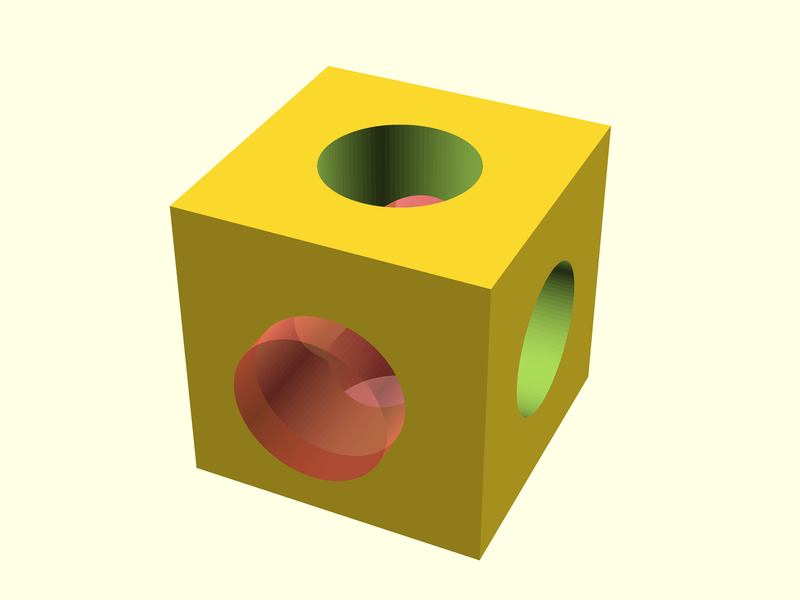
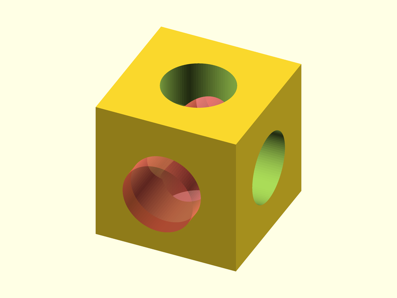

# OpenSCAD-renderer

HiRes rendering of OpenSCAD scripts.

## Inputs

| name      | required  | default       | description
| ---       | ---       | ---           | ---
| camera    | false     | -             | OpenSCAD camera position (see [^1])
| color-scheme | false  | Cornfield     | One of the OpenSCAD color scheme: Cornfield, Metallic, Sunset, Starnight, BeforeDawn, Nature, DeepOcean, Solarized, Tomorrow, Tomorrow Night, Monotone
| nightly | false | -             | if enabled the nightly version of OpenSCAD will be used with all the experimental features enabled
| openscad-path | false | -             | The OPENSCADPATH for custom user libraries
| picture   | false     | [^2]          | Target picture name (e.g. pictures/pic_1.png)
| projection| false     | 'perspective' | 'ortho' or 'perspective'
| render    | false     | false         | full OpenSCAD geometry evaluation when exporting png
| resolution| false     | 800x600       | Target image resolution in 'openscad' format (e.g. 1024x768)
| script    | true      | -             | OpenSCAD script
| view-axes | false     | true          | View axes

[^1]: OpenSCAD camera settings in the format `tx,ty,tz,rx,ry,rz,d`
  with `tx,ty,tz` for translations, `rx,ry,rz` for rotations and `d` for the distance

[^2]: the default is formed by the OpenSCAD script name with suffix replaced by `.png`.

### Parameter file names and Parameter sets

When the tool is executed, a check is made for the existance of a JSON parameter file whose  name is «script full path suffixed with .json». If found, it will be scanned for a Parameter set name equal to the «picture base name».

In other words the **scrip name** determines the **JSON Parameter file**, while the **target picture name** sets the **Parameter set name**.

## Usage examples

### Using defaults

    uses: ggabbiani/OpenSCAD-renderer@v1
    with:
      script: 'tests/logo.scad' # Path relative to the git repo root
      # «parameter file» defaulted to 'tests/logo.json'
      # «picture» defaulted to 'tests/logo.png'
      # «parameter set» to 'logo'
      # «resolution» defaulted to 800x600

The resulting picture will be saved as `tests/logo.png` with te default 800x600 resolution.

### Overriden inputs

    uses: ggabbiani/OpenSCAD-renderer@v1
    with:
      script:   'tests/logo.scad' # «parameter file» defaulted to 'tests/logo.json'
      picture:  'images/fig-1.png'# «parameter set» to 'fig-1'
      render:   true              # render flag modifies the rendering

